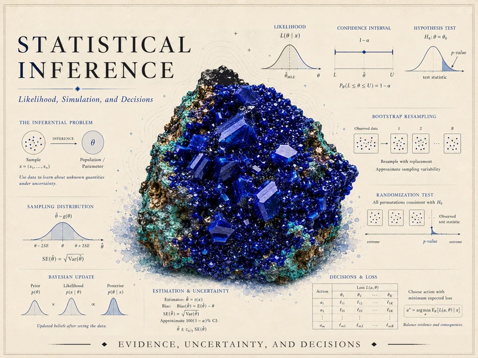

{srcset="assets/hero-web-800.webp 800w, assets/hero-web.webp 1400w" sizes="(min-width: 992px) 760px, 92vw" .course-hero-img fig-alt="Course identity hero for Statistical Inference — a deep-blue crystal cluster surrounded by inference graphics including the inferential problem (sample to parameter), a likelihood curve, a confidence interval, a hypothesis test, a sampling distribution, a Bayesian update, bootstrap resampling, a randomization test, and a decisions-and-loss table, with the course title."}

# Statistical Inference {.course-landing-title}

::: {.course-landing-subtitle}
Likelihood, simulation, and decisions — learning from data under uncertainty
:::

> Every dataset is a keyhole view of something larger — a population, a process, a truth we cannot
> observe directly. Statistical inference is the disciplined craft of reasoning back through that
> keyhole: from a sample to a defensible statement about what generated it, with the uncertainty of
> that step made explicit rather than hidden. It is how a single survey becomes a claim about a
> campus, how a handful of measurements becomes an estimate with a margin of error attached, and how
> we decide, honestly, when the evidence is strong enough to act on.

## What this course is

This course teaches inference as a **pluralistic** discipline. There is more than one coherent way to
reason from data to conclusions, and this course does not declare any one of them uniquely correct.
You will learn the classical frequentist toolkit — sampling distributions, estimators, confidence
intervals, hypothesis tests — alongside likelihood-based reasoning, simulation-based methods
(bootstrap and randomization), and an introduction to Bayesian updating. Each framework asks a
slightly different question of the same data, and part of the work of this course is learning to tell
those questions apart.

Throughout the semester we follow one recurring synthetic world: **the MAC Study**, a research team's
investigation of how students use UA Little Rock's Math Assistance Center. A population parameter —
an average visit duration, a usage rate — is treated as genuinely unknown, and a sample is treated as
the only evidence in hand, exactly as a real analyst would face it. The same sample numbers return
week after week, so that each new method (estimation, confidence intervals, testing, bootstrap,
permutation, Bayesian updating) attaches to a world you already know rather than a fresh one.

## What you will be able to do

By the end of the term, you should be able to:

- Describe a sampling distribution and explain why a statistic computed from a random sample is
  itself a random variable with its own spread.
- Evaluate an estimator by its bias, variance, and mean squared error, and explain the trade-off a
  biased estimator can offer.
- Write down a likelihood function for simple models, and derive and interpret a maximum likelihood
  estimate.
- Construct a confidence interval for a mean or a proportion, and state — correctly — what a
  confidence level does and does not promise.
- Carry out a hypothesis test, interpret a p-value without overclaiming, and connect Type I/Type II
  error rates to the power of a test.
- Build a bootstrap confidence interval and a randomization (permutation) test from resampling
  principles, without leaning on a formula you cannot justify.
- Update a Bayesian prior into a posterior using data, and summarize a posterior with a mean, SD, and
  credible interval.
- Compare what frequentist, likelihood-based, simulation-based, and Bayesian approaches each say about
  the same question, and recognize when their answers agree and when they do not.
- Connect an inference to a decision: state a simple loss or decision rule and explain what "acting
  on" an estimate or a test result actually commits you to.
- Communicate an estimate, an interval, or a test result to a nonspecialist audience without
  overstating what the data show.

## How the site is organized

This public site has three working areas, reachable from the sidebar:

- **[Notes](notes/index.qmd)** — the weekly instructional spine. Each week poses a question, develops
  the concept, works examples (including the recurring MAC Study), names a common mistake, and offers
  ungraded self-checks. Start here.
- **[Labs](labs/index.qmd)** — the simulation strand. Five short labs in R and Quarto let you confirm
  the theory by simulating sampling distributions, likelihood curves, bootstrap intervals,
  randomization tests, and a Bayesian posterior. Code is shown for study; you run it in your own
  session.
- **[Resources](resources/index.qmd)** — a notation glossary, a formula reference, and setup
  instructions for R and Quarto. Keep these open while you read.

## Software

We use **R** (via RStudio or Posit Cloud) together with **Quarto** for the simulation work. No paid
homework platform is used in this course. Software is a *support* for inference, not the center of
it: simulation lets you watch a sampling distribution, a bootstrap distribution, or a posterior take
shape, and checks reasoning you have already worked out by hand. In the notes and labs on this site, R
chunks are **shown as teaching examples** and are not executed in place; they are written in base R,
carry a set seed (`set.seed(35103)`), and are reproducible when you run them yourself.

## Source and attribution

These notes are the course's own synthesis, grounded in but not copied from three free, openly
licensed sources, each used at a different intensity:

- **Primary spine — [MIT OpenCourseWare 18.05](https://ocw.mit.edu/courses/18-05-introduction-to-probability-and-statistics-spring-2022/)**,
  *Introduction to Probability and Statistics* (**CC BY-NC-SA 4.0**, free). Used selectively across
  every week of the course to ground scope, sequence, and terminology.
- **Secondary, genuinely used co-source — [ModernDive](https://moderndive.com/v2/)**, *Statistical
  Inference via Data Science: A ModernDive into R and the Tidyverse*, 2nd ed. (Ismay, Kim, Valdivia),
  **CC BY-NC-SA 4.0**, free. Named and linked alongside 18.05 in the weeks where its strengths are the
  week's center: simulation-based inference, hypothesis testing, bootstrapping, and randomization,
  plus the closing synthesis week.
- **Optional supplementary review — [OpenIntro IMS](https://openintro-ims.netlify.app/)**,
  *Introduction to Modern Statistics*, 2nd ed. (Çetinkaya-Rundel & Hardin), **CC BY-SA 3.0**, free.
  Pointed to occasionally, in the more foundational and review weeks, always as an optional gentler
  alternative rather than required reading.

All example data on this site are synthetic, with a seed set. See the [Syllabus](syllabus.qmd) for
full attribution.

## Public vs. graded

Everything on this site is **public and ungraded** — study material only. No graded prompts, answer
keys, rubrics, point values, or due dates appear here. Graded inference checkpoints, quizzes,
homework, labs, the midterm, the project, and the final live in **Blackboard (the LMS)**, which is
authoritative for due dates, submissions, and grades. If this site and Blackboard ever disagree,
follow Blackboard.
