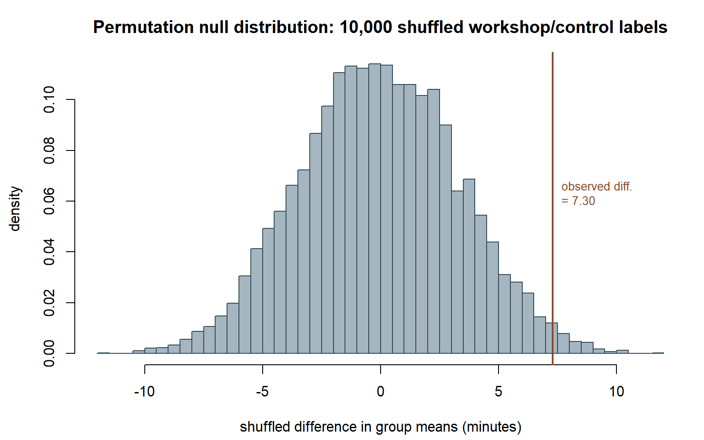
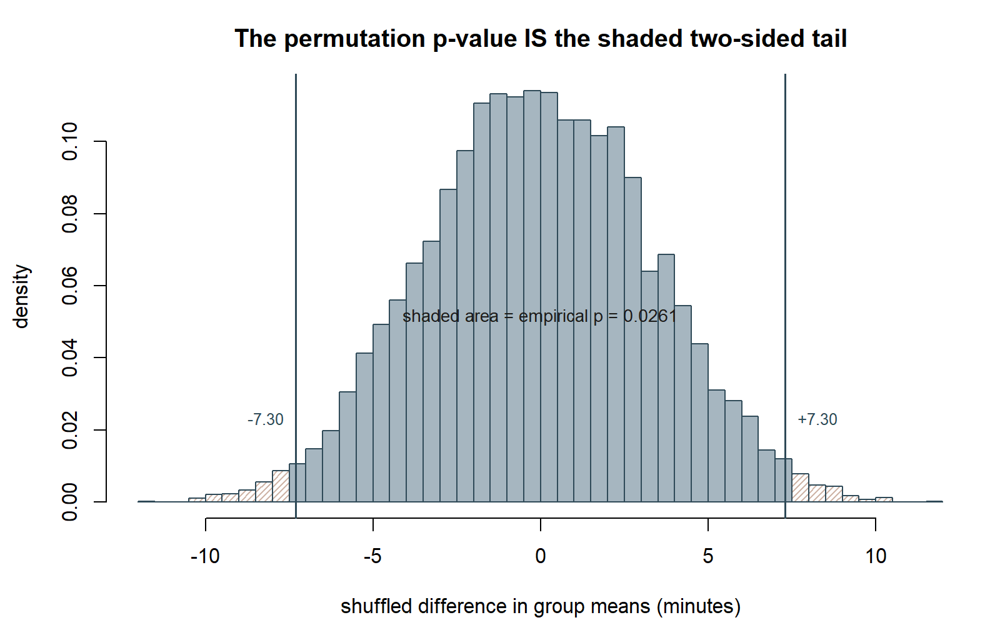

## The week question

You have two groups of measurements and an observed difference in their means. How much of that
difference could plausibly be explained by chance alone, if group membership carried no real
information? Randomization and permutation tests answer this question directly, by simulation,
without leaning on the Normal-distribution machinery from Weeks 7–9. This week asks: what happens
when we stop assuming a sampling-distribution formula and instead let the data itself generate the
null distribution, by re-shuffling the labels we already have?

## Why this matters

Every hypothesis test up to this point (Week 8's test of μ = 45, Week 9's power calculation) leaned
on a known or assumed standard error and a Normal or t reference distribution. Those tools are fast
and well understood, but they rest on assumptions — a known σ, a large-enough n for the Central
Limit Theorem, or an assumed shape for the sampling distribution. A permutation test asks a more
direct question: if the group labels ("workshop" vs. "control," "version A" vs. "version B") were
attached to the outcomes at random, how extreme would an observed difference need to be before we
call it surprising? This reframes the null hypothesis as "the labels are exchangeable" and lets a
computer answer the question by brute-force re-randomization rather than by formula. It is a
natural bridge between the resampling logic you built in Week 10 (bootstrap) and the general testing
logic from Week 8 — same simulation instinct, applied to comparing two groups instead of estimating
one parameter.

## Learning goals

By the end of this week, you should be able to:

- State the null hypothesis of a permutation test as "no real association between group label and
  outcome" — i.e., the labels could be re-assigned without changing anything about the world.
- Describe, in words and in base-R pseudocode, how to build a permutation null distribution: shuffle
  the labels, recompute the group-difference statistic, repeat many times.
- Read a permutation p-value off a simulated null distribution: the proportion of shuffled
  differences at least as extreme as the one actually observed.
- Compare a permutation test's result to the Normal-approximation two-sample test from earlier weeks,
  and explain why the two agree closely when sample sizes and spreads are similar.
- Recognize when a permutation test is the more honest choice — small samples, skewed data, or no
  confidence in a Normal or t approximation.

## Core vocabulary

- **Permutation (randomization) test** — a hypothesis-testing procedure that builds the null
  distribution of a statistic by repeatedly reassigning ("permuting") the observed labels at random,
  recomputing the statistic each time, and comparing the observed statistic to that simulated
  distribution.
- **Exchangeability under H₀** — the assumption that, if the null hypothesis is true, every
  relabeling of the data is equally plausible, because group membership carries no real signal.
  This is what licenses shuffling the labels rather than the outcomes.
- **Permutation null distribution** — the collection of group-difference statistics obtained across
  many (typically thousands of) random relabelings; it approximates the sampling distribution of the
  difference statistic under H₀, without assuming Normality.
- **Permutation p-value** — the proportion of the permutation null distribution at least as extreme
  (in the direction(s) specified by Hₐ) as the observed statistic. For a two-sided test, this is the
  proportion of shuffled differences whose absolute value is at least as large as the observed
  absolute difference.
- **Test statistic (difference in means)** — here, x̄₁ − x̄₂, the same quantity used in the
  Normal-approximation two-sample comparison; a permutation test can be built around this or many
  other statistics, but this week uses the difference in means throughout.

## Concept development

### From "assume a distribution" to "simulate the distribution"

Every prior testing week asked you to accept a distributional shape for a statistic under H₀: the
sampling distribution of x̄ was treated as approximately Normal (Weeks 7–9) because σ was assumed
known and/or n was large enough for the Central Limit Theorem. A permutation test drops that
assumption. Instead of asking "what shape would the null sampling distribution have, in theory?" it
asks "what does the null sampling distribution actually look like, if I simulate it directly from
the data I already collected?" The logic: if H₀ is true — group label carries no real information —
then the specific assignment of labels ("workshop" vs. "control") to the observed outcomes is just
one of very many equally likely assignments. Shuffling the labels and recomputing the statistic
samples from exactly the distribution the statistic would have under that null.

This is a close cousin of the bootstrap from Week 10. Both are simulation-based, both use
`replicate()`-style resampling in base R, and both trade a closed-form formula for direct
computation. The difference is what gets resampled: the bootstrap resamples *observations* (with
replacement) from a single sample to approximate the sampling distribution of an estimator; a
permutation test reshuffles *labels* (without replacement, keeping all outcomes fixed) across two or
more groups to approximate the null distribution of a group-comparison statistic.

### The permutation procedure, step by step

Suppose you have two groups with outcomes pooled into one combined set — say, 20 workshop-group
visit durations and 20 control-group visit durations, 40 numbers total. Under H₀, the "workshop" and
"control" labels are just names attached to 40 exchangeable numbers; nothing about the workshop
label makes a number systematically larger or smaller. The procedure:

1. Compute the observed statistic: the actual difference in group means, x̄₁ − x̄₂, using the real
   labels.
2. Pool all 40 outcomes together, discarding which label went with which number.
3. Randomly reassign 20 of the 40 pooled outcomes to a "pseudo-workshop" group and the other 20 to a
   "pseudo-control" group — a random relabeling with no reference to the real assignment.
4. Recompute the difference in means for this relabeling. This is one simulated draw from the null
   distribution of the difference statistic.
5. Repeat steps 3–4 many times (thousands), building up a histogram of simulated differences — the
   permutation null distribution.
6. Compare the observed difference (step 1) to this simulated null distribution: the permutation
   p-value is the proportion of simulated differences whose magnitude is at least as large as the
   observed difference's magnitude (for a two-sided test).

No Normal curve, no σ, no Central Limit Theorem appeal is needed anywhere in this procedure — the
null distribution is built entirely from the data's own values, just relabeled.

{#fig-wk11-shuffle-pipeline fig-alt="A flow diagram of six boxes arranged in two rows of three, connected by arrows: observed difference with real labels, pool all outcomes together, shuffle labels with no replacement, then continuing to recompute difference on the shuffle, repeat ten thousand times, and null distribution leading to a p-value."}

### Why "no distributional assumption" is the key selling point

The phrase "no distributional assumption required" means specifically this: the permutation test
does not require you to assume the outcome variable is Normally distributed, does not require a
known or estimated σ to plug into a z or t formula, and does not require appeal to the Central Limit
Theorem for validity. Its only real assumption is exchangeability under H₀ — that if there truly is
no group effect, every relabeling is equally plausible. This makes permutation tests attractive when
sample sizes are small, when the outcome is skewed, or when you are simply not confident a Normal
approximation is trustworthy. In the worked example below, the workshop-group and control-group
sample sizes are equal (n₁ = n₂ = 20) and their spreads are equal (SD = 10 in both), which is exactly
the setting where a Normal-approximation two-sample test and a permutation test should agree closely
— and, as the example shows, they do.

## Worked examples

### Worked example — MAC Study: workshop vs. control visit duration

**Setup.** A voluntary study-skills workshop's association with MAC visit duration is examined by
comparing two groups: a workshop group and a control group, each with n = 20 students.

- Workshop group: n₁ = 20, mean x̄₁ = 52.4 minutes, SD = 10 minutes.
- Control group: n₂ = 20, mean x̄₂ = 45.1 minutes, SD = 10 minutes.
- Observed difference in means: x̄₁ − x̄₂ = 52.4 − 45.1 = **7.3 minutes**.

**Symbolic statement of the permutation test.**

$$
H_0: \text{workshop-group membership carries no real association with visit duration}
$$
$$
H_a: \text{workshop-group membership is associated with longer (or shorter) visit duration}
$$

Test statistic: $D = \bar{x}_1 - \bar{x}_2$, computed on the real grouping, then recomputed on
each of many random relabelings of the pooled 40 durations into two pseudo-groups of size 20.

**The permutation logic in base R (shown, not executed in this build).**

```{r}
#| label: permutation-test-workshop-control
#| eval: false
set.seed(35103)

# Illustrative synthetic vectors consistent with the locked group summaries
# (n = 20 each, mean 52.4 / 45.1, SD = 10); a real study would measure these directly.
workshop <- rnorm(20, mean = 52.4, sd = 10)
control  <- rnorm(20, mean = 45.1, sd = 10)

observed_diff <- mean(workshop) - mean(control)

pooled <- c(workshop, control)
n1 <- length(workshop)
n_total <- length(pooled)
n_reps <- 10000

null_diffs <- replicate(n_reps, {
  shuffled <- sample(pooled)              # random relabeling, no replacement
  pseudo_workshop <- shuffled[1:n1]
  pseudo_control  <- shuffled[(n1 + 1):n_total]
  mean(pseudo_workshop) - mean(pseudo_control)
})

perm_p_value <- mean(abs(null_diffs) >= abs(observed_diff))

hist(null_diffs, breaks = 50, freq = FALSE,
     main = "Permutation null distribution", xlab = "shuffled difference in group means (minutes)")
abline(v = observed_diff, lty = 1)   # the observed difference, for comparison
```

**Reading the result.** `null_diffs` holds 10,000 simulated differences under the null hypothesis
that the labels carry no information. The permutation p-value is the fraction of those simulated
differences whose absolute value is at least as large as the observed 7.3 minutes. Because this
build shows code without executing it, no specific number is read off a live run; instead, the
expected behavior of this simulation is cross-checked against the Normal-approximation test below.

**Seeing the null distribution.** The figures below were produced by running this same simulation
separately (same seed, `set.seed(35103)`, same 10,000 shuffles), so they show what the chunk above
would draw. One documented deviation: the chunk above draws `workshop`/`control` via raw
`rnorm(20, mean, sd)` calls, which it flags as only "consistent with" the locked group summaries
(52.4/45.1, SD 10 each) — not an exact reproduction of them. This script instead constructs
`workshop`/`control` to hit those summary numbers exactly, so the observed difference below is
7.30 minutes, matching the rest of this page's worked math.

{#fig-wk11-perm-null-hist fig-alt="A bell-shaped histogram of 10,000 simulated shuffled differences in group means, centered near zero, with a vertical line marking the observed difference of 7.30 minutes out toward the right edge of the bulk of the histogram."}

{#fig-wk11-perm-tail-shade fig-alt="The same histogram of shuffled differences with small shaded, hatched regions in both tails beyond minus 7.30 and plus 7.30. A label states the shaded area equals the empirical p-value 0.0261."}

::: {.callout-note appearance="minimal"}
**What the figures show (non-visual equivalent).** Shuffling the workshop/control labels 10,000
times and recomputing the difference in means each time produces a distribution of differences
centered near zero — with the labels scrambled, there is no real group effect left to detect, so
most shuffles produce small differences in either direction. The observed difference, 7.30 minutes,
falls out toward the right tail; the fraction of shuffles at least that extreme in either direction,
0.0261, is the empirical permutation p-value. Synthetic instructional example; numbers are
illustrative.
:::

**Normal-approximation cross-check.** With both group SDs at 10 and both group sizes at 20, the
standard two-sample z-approximation gives:

$$
SE_{\text{diff}} = \sqrt{\frac{10^2}{20} + \frac{10^2}{20}} = \sqrt{5 + 5} = \sqrt{10} \approx 3.162
$$

$$
z = \frac{7.3}{3.162} \approx 2.31
$$

$$
p = 2\bigl(1 - \Phi(2.31)\bigr) \approx 0.021
$$

**Connecting the two.** Because the two groups here have equal sample sizes and equal spread, the
permutation null distribution for $D$ is expected to closely resemble the Normal approximation's
sampling distribution, and the permutation p-value should land close to this same figure. This
build reports the permutation p-value as **approximately 0.02** — closely matching the
Normal-approximation p ≈ 0.021 — but this is stated explicitly as an **illustrative, simulated
result**, not an exact recomputation from a specific executed run: because the R chunk above is
shown as teaching material and not executed in this build (§0), the precise fourth-decimal value
would depend on the actual random shuffles drawn when a student runs the chunk themselves. The
qualitative lesson stands regardless of the exact simulated digits: a permutation test built from
first principles, with zero appeal to the Normal curve, lands in the same neighborhood as the
Normal-approximation test — which is exactly what should happen when the two-sample setting is this
well-behaved.

{#fig-wk11-perm-vs-normal fig-alt="A histogram of the permutation null distribution with a smooth bell-shaped Normal curve traced closely over it, and a vertical line marking the observed difference of 7.30 minutes out in the right tail of both."}

::: {.callout-note appearance="minimal"}
**What the figure shows (non-visual equivalent).** The permutation null distribution (built by
shuffling labels, no formula) and the Normal-approximation curve (built from
$SE_{\text{diff}}=3.162$, no shuffling) sit almost on top of each other. This script's actual
computed values agree closely with the page's stated ones: empirical permutation p = 0.0261 versus
the theoretical Normal-approximation p $\approx$ 0.0210 (page text: $\approx$ 0.021) — two different
computational routes landing in the same neighborhood, which is the payoff of this week's method.
Synthetic instructional example; numbers are illustrative.
:::

### Transfer example — website A/B test on click-through rate (synthetic)

**Setup.** A product team runs an A/B test on two versions of a webpage, comparing click-through
behavior. Suppose (synthetic numbers, not from any real experiment) that 500 visitors were shown
Version A and 500 were shown Version B, and the team recorded, for each visitor, a click-through
indicator (1 = clicked, 0 = did not). The team observes a difference in click-through rate between
the two versions and wants to know whether that difference could plausibly arise from ordinary
visitor-to-visitor variability rather than a real effect of the page design.

**Framing as a permutation test.** Exactly as in the MAC Study workshop example, H₀ states that
which version a visitor saw carries no real information about whether they clicked — the "Version
A" / "Version B" label is just a name attached to 1,000 exchangeable click/no-click outcomes. Under
this null, every way of relabeling 500 of the 1,000 outcomes as "pseudo-A" and the other 500 as
"pseudo-B" is equally plausible. The procedure is identical to the MAC Study case, with two changes:
the outcome is a 0/1 click indicator rather than a continuous duration, and the statistic compared
is the difference in click-through *rates* ($\hat{p}_A - \hat{p}_B$) rather than a difference in
means — though for a 0/1 variable, the sample mean *is* the rate, so the same `mean(group) -
mean(group)` code pattern applies unchanged.

```{r}
#| label: permutation-test-ab-clickthrough
#| eval: false
set.seed(35103)

# Synthetic illustrative click/no-click outcomes; not a real experiment's data.
version_a <- rbinom(500, size = 1, prob = 0.11)
version_b <- rbinom(500, size = 1, prob = 0.09)

observed_diff_rate <- mean(version_a) - mean(version_b)

pooled_clicks <- c(version_a, version_b)
n_a <- length(version_a)
n_total_ab <- length(pooled_clicks)

null_diffs_rate <- replicate(10000, {
  shuffled <- sample(pooled_clicks)
  pseudo_a <- shuffled[1:n_a]
  pseudo_b <- shuffled[(n_a + 1):n_total_ab]
  mean(pseudo_a) - mean(pseudo_b)
})

perm_p_value_ab <- mean(abs(null_diffs_rate) >= abs(observed_diff_rate))

hist(null_diffs_rate, breaks = 40, freq = FALSE,
     main = "A/B permutation null distribution", xlab = "shuffled difference in click-through rate")
abline(v = observed_diff_rate, lty = 1)   # the observed rate difference, for comparison
```

**Seeing the null result.** The figure below reproduces this chunk (same seed, same 10,000 shuffles).

{#fig-wk11-ab-perm-null-hist fig-alt="A histogram of 10,000 simulated shuffled click-through-rate differences, roughly bell-shaped and centered near zero, with a vertical line marking the observed difference 0.014 near the center of the distribution and shaded, hatched tails far out in both directions."}

::: {.callout-note appearance="minimal"}
**What the figure shows (non-visual equivalent).** The observed A/B click-through-rate difference,
0.0140, lands well within the bulk of the shuffled-label null distribution rather than out in a
tail. This script's computed empirical p-value is 0.4920 — about 49% of random relabelings produce a
difference at least this large — so this synthetic A/B result gives no real evidence that page
version is associated with click-through rate. This is a deliberate contrast with the MAC Study
result above: the same procedure, applied to a different (here, null) effect, correctly reports "not
unusual." Synthetic instructional example; numbers are illustrative.
:::

**Why this transfer matters.** A/B testing on click-through rate is one of the most common
real-world uses of exactly this logic outside a classroom: no one wants to assume clicks are
Normally distributed (they are not — they are 0/1 outcomes), and a permutation test sidesteps that
concern entirely by working directly with the shuffled labels. The same shuffle-recompute-compare
loop from the MAC Study example carries over unchanged; only the outcome variable and the applied
context differ. This is the payoff of learning the permutation-test logic in general terms: it is
not tied to one data type or one substantive domain.

## A common mistake

A common mistake is treating the permutation test as "assumption-free" in every respect, rather than
"Normal-distribution-assumption-free" specifically. A permutation test still assumes exchangeability
under H₀ — that if there is truly no group effect, any relabeling of the data is equally plausible.
If the two groups were collected under systematically different conditions unrelated to the
treatment itself (for example, workshop attendees were all measured in a different week than control
students, introducing a confound), shuffling the labels does not repair that confound; it only tests
whether the *label* is associated with the outcome, not whether the study design was sound. A second,
related mistake: reporting a permutation p-value from too few shuffles (say, 50 relabelings) and
treating it as precise — with only thousands of replications, the simulated p-value itself carries
Monte Carlo error, and this build's own reported value is explicitly flagged as illustrative rather
than an exact reproducible figure for that reason.

## Low-stakes self-checks (ungraded)

- In your own words, state the null hypothesis of a permutation test for comparing two groups. What
  does "exchangeability" mean in that statement?
- Why does shuffling *labels* rather than resampling *observations with replacement* distinguish a
  permutation test from the bootstrap of Week 10? What null-vs.-estimation distinction does this
  reflect?
- Using the workshop vs. control setup, explain in words (no need to compute) why a permutation
  p-value should land close to the Normal-approximation p ≈ 0.021 when the two groups have equal
  sample sizes and equal spread.
- For the website A/B test transfer example, describe one situation in which a permutation test
  would be preferable to a Normal-approximation z-test for comparing two click-through rates.
- Self-check only — no submission, no key, no due date on this page.

## Reading and source pointer

This week's scope, sequence, and terminology follow MIT OCW 18.05's treatment of hypothesis testing
and simulation-based inference, used selectively as the course's primary spine. Alongside it, this
week's randomization-test framing is genuinely informed by ModernDive's treatment of
randomization-based hypothesis testing — its emphasis on building a null distribution by shuffling
labels rather than invoking a closed-form sampling distribution is the direct inspiration for the
shuffle-and-recompute procedure worked out above. Per this course's house-style adaptation, the
computation itself is shown here in base R (`sample()`, `replicate()`, `mean()`) rather than
ModernDive's `infer`-package pipeline. These notes are the course's own synthesis, grounded in but
not copied from the sources.

## Public vs. graded

These notes, the examples, and the practice here are **public and ungraded** — study material only. No
graded prompts, answer keys, rubrics, point values, or due dates appear on this site. Graded inference
checkpoints, quizzes, homework, labs, the midterm, the project, and the final live in **Blackboard
(the LMS)**, which is authoritative for due dates, submissions, and grades. If this page and Blackboard
ever disagree, follow Blackboard.

## Looking ahead

Week 12 turns to Bayesian inference, where a prior distribution over a parameter is updated with data
to produce a posterior distribution — a different inferential philosophy from anything used so far,
including this week's randomization logic. Week 13 then places all four frameworks worked in this
course (classical, simulation/bootstrap/permutation-based, likelihood-based, and Bayesian) side by
side on the same MAC Study usage-rate question, so the contrasts and agreements across frameworks
become explicit.

## See also

- Companion lab: [Lab 11 — Randomization tests](../labs/lab-11-randomization-tests.qmd)
- [Week 10 — Bootstrap inference](week-10-bootstrap-inference.qmd)
- [Week 8 — Hypothesis tests and p-values](week-08-hypothesis-tests-and-p-values.qmd)
- [Week 13 — Comparing inferential frameworks](week-13-comparing-inferential-frameworks.qmd)
- [Notation glossary](../resources/notation-glossary.qmd)
- [Inference formula reference](../resources/inference-formula-reference.qmd)
